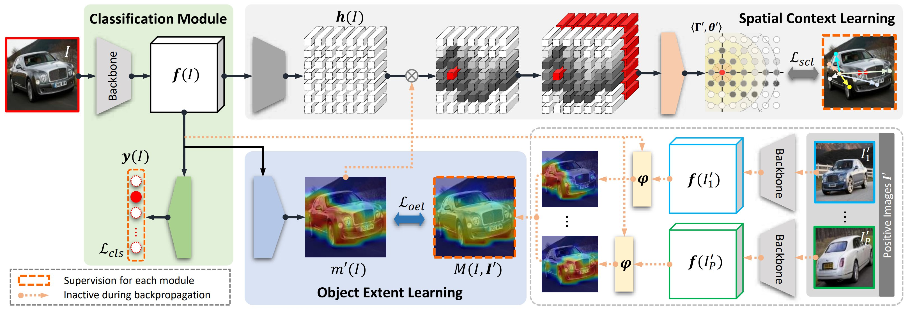

# Look_into_object_project [Blog link](https://www.notion.so/Look-into-Object-Self-supervised-Structure-Modeling-for-Object-Recognition-826021bdb7ce4969a92c157f0e0acfbe)
This is unofficial pytorch implementation of [Look_into_object paper](https://openaccess.thecvf.com/content_CVPR_2020/html/Zhou_Look-Into-Object_Self-Supervised_Structure_Modeling_for_Object_Recognition_CVPR_2020_paper.html). <br>
This repository is created for the Visual Media class of UTokyo (as my class report). <br>
Check the [blog](https://www.notion.so/Look-into-Object-Self-supervised-Structure-Modeling-for-Object-Recognition-826021bdb7ce4969a92c157f0e0acfbe) for details.



## Getting started
This work was tested with PyTorch 1.2.0, torchvision 0.4.0, CUDA 10.0, python 3.6 and Ubuntu 16.04. <br>
requirements: numpy, pillow, torchvision, tqdm, pretrainedmodels, pandas 
```
pip install numpy pillow torchvision tqdm pretrainedmodels pandas 
```

## Train
Train Look Into Object (LIO) module
```
CUDA_VISIBLE_DEVICES=0 python train.py --data CUB --mo LIO --exp_name LIO
CUDA_VISIBLE_DEVICES=1 python train.py --data STCAR --mo LIO --exp_name LIO
CUDA_VISIBLE_DEVICES=2 python train.py --data AIR --mo LIO --exp_name LIO
```
Train Object-Extent Learning (OEL) module
```
CUDA_VISIBLE_DEVICES=0 python train.py --data CUB --mo OEL --exp_name OEL
CUDA_VISIBLE_DEVICES=1 python train.py --data STCAR --mo OEL --exp_name OEL
CUDA_VISIBLE_DEVICES=2 python train.py --data AIR --mo OEL --exp_name OEL
```
Train Spatial Context Learning (SCL) module
```
CUDA_VISIBLE_DEVICES=0 python train.py --data CUB --mo SCL --exp_name SCL
CUDA_VISIBLE_DEVICES=1 python train.py --data STCAR --mo SCL --exp_name SCL
CUDA_VISIBLE_DEVICES=2 python train.py --data AIR --mo SCL --exp_name SCL
```
Train baseline (ResNet50)
```
CUDA_VISIBLE_DEVICES=0 python train.py --data CUB --exp_name baseline
CUDA_VISIBLE_DEVICES=1 python train.py --data STCAR --exp_name baseline
CUDA_VISIBLE_DEVICES=2 python train.py --data AIR --exp_name baseline
```

## Test
```
CUDA_VISIBLE_DEVICES=0 python test.py --data CUB --save saved_models/[path-to-trained_model]
CUDA_VISIBLE_DEVICES=1 python test.py --data STCAR --save saved_models/[path-to-trained_model]
CUDA_VISIBLE_DEVICES=2 python test.py --data AIR --save saved_models/[path-to-trained_model]
```

## Acknowledgement
We borrowed some codes from [DCL repository](https://github.com/JDAI-CV/DCL)
